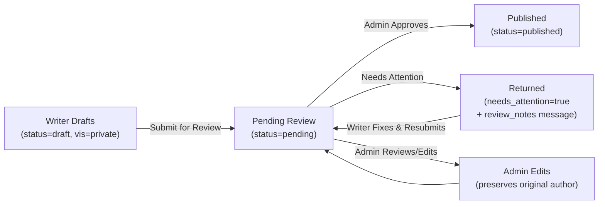

# Newsroom Overhaul — Editorial Workflow & Bug Fixes (v2)

> Based on two feedback reports: "Newsroom: Patch" (Thamindu Hasarinda) and "Newsroom: Writer Role Side Issues" (ICMU Developer), Aug 26 2026.
> Updated with user feedback on open questions.

## Overview

The current news management system has multiple interrelated issues spanning **public page data leaks**, **broken role-based access**, **confusing draft/status semantics**, **missing editorial workflow**, **fragile identity tracking**, and **UI inconsistencies**. This plan addresses every reported issue, redesigns the editorial workflow to match industry-standard CMS patterns (WordPress, Medium, Ghost), migrates `submitted_by` from fragile text to stable UUIDs, and updates both RLS policies and client-side logic.

---

## Resolved Questions

| Question | Decision |
|----------|----------|
| Super Admin draft visibility | **Respect privacy** — even super_admins cannot see other users' drafts |
| `submitted_by` column type | **Change to UUID** (`user.id`), keep `author` as display text |
| Review notes format | **Admin messages only** (simple JSONB array, no threaded replies) |
| Existing `rejected` rows | Migrate to `needs_attention=true, status=draft` |
| RLS policies | **Yes, exist and must be updated** — add writer SELECT/INSERT policies |
| Cache invalidation | **Force refetch after mutations** using `fetchNews(true)` |

---

## User Review Required

> [!CAUTION]
> **Schema Migration (Breaking)** — `submitted_by` changes from TEXT (names) to TEXT (UUID references). Existing text values must be mapped to user UUIDs via a migration script. Rows that can't be mapped will retain their text value and need manual cleanup. New columns `needs_attention` (BOOLEAN) and `review_notes` (JSONB) are also added.

> [!IMPORTANT]
> **RLS Policy Expansion** — Currently, only admins can INSERT/UPDATE/DELETE news, and only `published + public` items are SELECTable by anon users. We need to add **writer policies** so writers can INSERT their own articles and SELECT/UPDATE their own drafts via the `submitted_by` UUID column.

> [!WARNING]
> **`submitted_by` Migration Risk** — The current column stores various text formats (`user.name`, `user.indexNumber`, `"Admin"`, `"Writer"`, etc.). The migration will attempt to resolve each to a `users.id` UUID. Unresolvable values are left as-is but will break ownership checks until manually fixed.

---

## Root Cause Analysis (All 14+ Issues)

| # | Issue | Root Cause | Fix Location |
|---|-------|-----------|--------------|
| 1 | Unlisted/private posts visible on public pages | `NewsPage.jsx` L574-592: filters `pending`, `draft`, `private`, `unlisted` — misses `rejected`. `NewsSection.jsx` L18-21 uses permissive `n.is_active !== false` | NewsPage, NewsSection, AuthorPage |
| 2 | Public users see pending/rejected via direct URL | `fetchArticleById` has no status/visibility check — `/news/:id` works for ANY article | ArticleViewer, DataContext |
| 3 | Writer drafts visible to admins | `ManageNews.jsx` L196-200: only checks `submitted_by` for non-admins | ManageNews |
| 4 | Draft sets `visibility=public` | `useArticleForm.js` L38: default `visibility: "public"`, L246: `formData.visibility \|\| "public"` | useArticleForm |
| 5 | "Suggest Edit" changes author identity | `useArticleForm.js` L251-253: on edit, sets `author` to `formData.author \|\| formData.submitted_by` — admin's edit session may overwrite | useArticleForm |
| 6 | Updates display `title` (should use `content`) | Grid/List/Board views render `item.title` for updates | All admin views |
| 7 | Analytics card shown for updates | `ManageNews.jsx` L122: fetches analytics regardless of type. L882-1049: analytics card always renders | ManageNews |
| 8 | QuickViewModal wrong aspect ratio for updates | `QuickViewModal.jsx` L74: hardcoded `object-contain` | QuickViewModal, ManageNews modal |
| 9 | Updates list view shows redundant "Public" badge | `NewsListView.jsx` L166-170: always shows visibility badge | NewsListView |
| 10 | Article content shows raw HTML in public previews | `getPreview()` strips tags but doesn't decode HTML entities | NewsPage |
| 11 | Author page ignores login state | `AuthorPage.jsx` L41-42: filters out `pending`/`draft` for ALL users | AuthorPage |
| 12 | No article editor stepper | Article wizard steps exist but no progress/nav UI | article-wizard/ |
| 13 | Form buttons lack disabled logic | `useArticleForm.js`: no dirty tracking, double-submit possible | useArticleForm, useUpdateForm |
| 14 | No "Needs Attention" workflow | No mechanism for admin review notes | Schema + ManageNews |
| 15 | `submitted_by` uses fragile text matching | `submitted_by` stores names/indexNumbers, comparisons try 5+ fields | Schema + 6 files |
| 16 | Stale data after mutations | `fetchedRef.current.news` prevents refetch after add/update/delete | DataContext + AuthorPage |
| 17 | Writer can't INSERT via RLS | Only admin INSERT policy exists — writers blocked at DB level | RLS migration |

---

## Proposed Changes

### Component 1: Schema Migration

#### [NEW] `supabase/migrations/20260826100000_newsroom_overhaul.sql`

```sql
-- ═══════════════════════════════════════════════════════════════
-- 1. ADD NEW COLUMNS
-- ═══════════════════════════════════════════════════════════════
ALTER TABLE public.news
  ADD COLUMN IF NOT EXISTS needs_attention boolean DEFAULT false,
  ADD COLUMN IF NOT EXISTS review_notes jsonb DEFAULT '[]'::jsonb;

CREATE INDEX IF NOT EXISTS idx_news_needs_attention
  ON public.news USING btree (needs_attention) WHERE needs_attention = true;

-- ═══════════════════════════════════════════════════════════════
-- 2. MIGRATE submitted_by TEXT → USER UUIDs
-- Attempt to resolve existing text values to users.id
-- ═══════════════════════════════════════════════════════════════
UPDATE public.news n
SET submitted_by = u.id::text
FROM public.users u
WHERE n.submitted_by IS NOT NULL
  AND n.submitted_by != ''
  AND n.submitted_by NOT LIKE '%-%-%-%-%'  -- skip already-UUID values
  AND (
    u.full_name = n.submitted_by
    OR u.index_number::text = n.submitted_by
    OR u.email = n.submitted_by
  );

-- ═══════════════════════════════════════════════════════════════
-- 3. MIGRATE rejected → needs_attention
-- ═══════════════════════════════════════════════════════════════
UPDATE public.news
SET needs_attention = true, status = 'draft'
WHERE status = 'rejected';

-- ═══════════════════════════════════════════════════════════════
-- 4. FIX: drafts should be visibility=private
-- ═══════════════════════════════════════════════════════════════
UPDATE public.news
SET visibility = 'private'
WHERE status = 'draft' AND visibility = 'public';

-- ═══════════════════════════════════════════════════════════════
-- 5. RLS POLICY UPDATES
-- ═══════════════════════════════════════════════════════════════

-- Writers can view their OWN articles (any status)
DROP POLICY IF EXISTS "Writers can view own news" ON public.news;
CREATE POLICY "Writers can view own news"
    ON public.news FOR SELECT
    USING (
      submitted_by = public.get_request_user_id()::text
    );

-- Writers can INSERT articles (submitted as pending/draft)
DROP POLICY IF EXISTS "Writers can insert news" ON public.news;
CREATE POLICY "Writers can insert news"
    ON public.news FOR INSERT
    WITH CHECK (
      public.get_request_user_role() IN ('writer', 'admin', 'super_admin', 'super-admin', 'superadmin')
    );

-- Writers can UPDATE their OWN drafts/pending articles
DROP POLICY IF EXISTS "Writers can update own news" ON public.news;
CREATE POLICY "Writers can update own news"
    ON public.news FOR UPDATE
    USING (
      submitted_by = public.get_request_user_id()::text
      AND status IN ('draft', 'pending')
    );

-- Writers can DELETE their OWN drafts only
DROP POLICY IF EXISTS "Writers can delete own drafts" ON public.news;
CREATE POLICY "Writers can delete own drafts"
    ON public.news FOR DELETE
    USING (
      submitted_by = public.get_request_user_id()::text
      AND status = 'draft'
    );
```

**Status values (final)**: `draft` | `pending` | `published`
**Visibility values**: `public` | `private` | `unlisted` | `members_only`
**`submitted_by`**: UUID string (references `users.id`)
**`author`**: Display name text (kept as-is)

**`review_notes` JSONB format**:
```json
[
  { "by": "admin-uuid", "name": "Admin Name", "message": "Fix paragraph 2", "at": "2026-08-26T12:00:00Z" }
]
```

---

### Component 2: Data Context — Secure Fetching & Cache Invalidation

#### [MODIFY] [DataContext.jsx](file:///c:/Users/User/Documents/DEV%20PROJECTS/icmu-web/src/context/DataContext.jsx)

1. **`fetchArticleById()`** — Add auth-aware access guard:
   - Unauthenticated: return only if `status === 'published' && visibility === 'public'`
   - Own content (`submitted_by === user.id`): return any status
   - Admin: return any status
   - Else: return `null`

2. **`addNews()` / `updateNews()` / `deleteNews()`** — After each mutation, call `fetchNews(true)` to force-invalidate the cache and get latest data. Currently these likely just update local state without refetching.

3. **`fetchNews()` select** — Add `needs_attention, review_notes` to the select query

---

### Component 3: Public Pages — Security Filtering

#### [MODIFY] [NewsPage.jsx](file:///c:/Users/User/Documents/DEV%20PROJECTS/icmu-web/src/pages/landing-page/NewsPage.jsx)

- **L574-592**: For non-authenticated users: `status === 'published' && visibility === 'public'`
- For authenticated non-admin users: additionally show own content regardless of status
- `getPreview()`: Add HTML entity decoding (`&amp;` → `&`, `&lt;` → `<`, etc.)

#### [MODIFY] [NewsSection.jsx](file:///c:/Users/User/Documents/DEV%20PROJECTS/icmu-web/src/components/sections/NewsSection.jsx)

- **L18-21**: Replace `n.status === 'published' || n.is_active !== false` with strict: `n.status === 'published' && n.visibility === 'public' && n.type !== 'update'`

#### [MODIFY] [ArticleViewer.jsx](file:///c:/Users/User/Documents/DEV%20PROJECTS/icmu-web/src/pages/landing-page/ArticleViewer.jsx)

- Post-fetch access control: show 404/access-denied for unauthorized access
- Use `useAuth()` to check `user.id === article.submitted_by` for own-content access

#### [MODIFY] [AuthorPage.jsx](file:///c:/Users/User/Documents/DEV%20PROJECTS/icmu-web/src/pages/landing-page/AuthorPage.jsx)

- Import `useAuth`, add role-based filtering:
  - Not logged in: `status === 'published' && visibility === 'public'`
  - Logged in viewing own profile: show `private`, `unlisted`, `members_only` too
  - Admin: show all published (not other people's drafts)
- **Cache invalidation**: Call `fetchNews(true)` on mount to ensure latest data (not cached)

---

### Component 4: Admin Panel — Draft Isolation & Workflow

#### [MODIFY] [ManageNews.jsx](file:///c:/Users/User/Documents/DEV%20PROJECTS/icmu-web/src/pages/admin/ManageNews.jsx)

**Identity comparison (all `submitted_by` checks):**
- Replace `item.submitted_by !== (user?.name || user?.indexNumber)` → `item.submitted_by !== user?.id`
- This applies to L141, L198, and any other ownership checks

**Draft isolation:**
- `if (item.status === 'draft' && item.submitted_by !== user?.id) return false` — for ALL roles

**Tab changes (admins):**
- Keep: `articles`, `updates`, `pending`
- Add: `needs_attention` tab

**Tab changes (writers):**
- Keep: `published`, `pending`, `draft`
- Remove: `rejected` tab
- Show `needs_attention` badge on drafts that have `needs_attention === true`

**Replace `handleReject` → `handleNeedsAttention`:**
- Sets `needs_attention = true`, appends admin message to `review_notes` JSONB
- Does NOT change status — stays `pending`
- Show modal with textarea for admin message

**"Suggest Edit" author preservation:**
- Navigate with `?review=true` param
- Edit page: if `review=true`, preserve original `submitted_by` and `author`

**Analytics conditional:**
- L882-1049: Wrap in `{viewingArticle.type !== 'update' && (...)}`
- L838-860: Hide mobile analytics tab for updates

**Modal image aspect ratio:**
- `viewingArticle.type === 'update' ? '' : 'aspect-video'`

---

### Component 5: Forms — Identity & Draft Logic

#### [MODIFY] [useArticleForm.js](file:///c:/Users/User/Documents/DEV%20PROJECTS/icmu-web/src/hooks/admin/useArticleForm.js)

- **L245**: `payload.submitted_by = user?.id` (not `user?.name || user?.indexNumber`)
- **L38**: Default `visibility: "private"` for new articles (draft = private)
- **L48-54 `canEditMetadata`**: Change to `formData.submitted_by === user?.id`
- **L97-99 `authorMatch`**: Change to `article.submitted_by === user?.id`
- **Draft save**: Set `status = 'draft'`, `visibility = 'private'`
- **Submit for review**: Set `status = 'pending'`, keep `visibility` as user chose
- **Add dirty tracking**: Store `initialFormData` on load, compare before save
- **Disable button**: Export `isDirty` flag — `JSON.stringify(formData) !== JSON.stringify(initialFormData)`

#### [MODIFY] [useUpdateForm.js](file:///c:/Users/User/Documents/DEV%20PROJECTS/icmu-web/src/hooks/admin/useUpdateForm.js)

- **L255**: `payload.submitted_by = user?.id`
- **L38**: Change `canEditMetadata` to use `formData.submitted_by === user?.id`
- **L49**: Change `authorMatch` to use `existingUpdate.submitted_by === user?.id`
- **Add dirty tracking** same as useArticleForm

---

### Component 6: Admin Views — Updates Differentiation

#### [MODIFY] [NewsListView.jsx](file:///c:/Users/User/Documents/DEV%20PROJECTS/icmu-web/src/components/admin/NewsListView.jsx)

- **L139-141**: `item.type === 'update'` → show truncated `item.content` instead of `item.title`
- **L146-170**: When `activeTab === 'updates'` → skip visibility badge entirely
- **Pending/Draft** rows: show `--` for view counts

#### [MODIFY] [NewsGridView.jsx](file:///c:/Users/User/Documents/DEV%20PROJECTS/icmu-web/src/components/admin/NewsGridView.jsx)

- Same content/title swap for updates
- Same visibility badge suppression

#### [MODIFY] [NewsBoardView.jsx](file:///c:/Users/User/Documents/DEV%20PROJECTS/icmu-web/src/components/admin/NewsBoardView.jsx)

- Same logic

#### [MODIFY] [NewsCalendarView.jsx](file:///c:/Users/User/Documents/DEV%20PROJECTS/icmu-web/src/components/admin/NewsCalendarView.jsx)

- Same logic

---

### Component 7: QuickViewModal — Type-Aware

#### [MODIFY] [QuickViewModal.jsx](file:///c:/Users/User/Documents/DEV%20PROJECTS/icmu-web/src/components/admin/QuickViewModal.jsx)

- **Image aspect ratio**: `type === 'update'` → natural/`aspect-auto`; else → `aspect-video`
- **Title vs content**: Updates show `content` preview; articles show `title`

---

### Component 8: Utilities

#### [MODIFY] [NewsUtils.js](file:///c:/Users/User/Documents/DEV%20PROJECTS/icmu-web/src/components/admin/NewsUtils.js)

- `resolveBadgeInfo()`: For `item.type === 'update' && item.status === 'published'`, skip visibility badge
- Add `needs_attention` badge type: `{ label: "Needs Attention", className: "bg-orange-500/20 text-orange-300 ..." }`
- `resolveAuthorInfo()`: Support UUID-based `submitted_by` lookups (find user by `u.id === item.submitted_by`)

---

### Component 9: Article Wizard Stepper

#### [NEW] `src/components/admin/article-wizard/ArticleStepper.jsx`

- Visual step indicator: 1. Category → 2. Content → 3. Media → 4. Review
- Clickable completed steps for back-navigation
- Current step highlighted with accent color
- Integrates into existing article create/edit page

---

### Component 10: Dashboard

#### [MODIFY] [Dashboard.jsx](file:///c:/Users/User/Documents/DEV%20PROJECTS/icmu-web/src/pages/admin/Dashboard.jsx)

- **L249-253**: Change all `submitted_by` comparisons to `item.submitted_by === user?.id`

---

### Component 11: Update Form

#### [MODIFY] [UpdateFormSection.jsx](file:///c:/Users/User/Documents/DEV%20PROJECTS/icmu-web/src/components/admin/update-form/UpdateFormSection.jsx)

- Remove or make `title` field optional/hidden for updates
- Primary input is `content`

---

## New Editorial Workflow



**Key rules:**
- `submitted_by` = UUID of the person who created it (never changes)
- `author` = display name (text, can be "Isipathana College Media Unit" for anonymous)
- Admin can NEVER become `submitted_by` of someone else's article
- Drafts are invisible to everyone except their creator
- Updates are always `visibility=public` (no draft/visibility workflow)

---

## File Change Summary

| File | Action | Priority | Key Changes |
|------|--------|----------|-------------|
| **Migration SQL** (NEW) | Schema + RLS | P0 | `needs_attention`, `review_notes`, `submitted_by` → UUID, writer RLS policies |
| `DataContext.jsx` | Modify | P0 | Secure `fetchArticleById`, add `needs_attention`/`review_notes` to select, force-refetch after mutations |
| `NewsPage.jsx` | Modify | P0 | Strict public filtering, HTML entity decode |
| `NewsSection.jsx` | Modify | P0 | Strict `published + public + article-only` filter |
| `ArticleViewer.jsx` | Modify | P0 | Access control, 404 for unauthorized |
| `useArticleForm.js` | Modify | P0 | `submitted_by = user.id`, draft=private, dirty tracking |
| `useUpdateForm.js` | Modify | P0 | `submitted_by = user.id`, dirty tracking |
| `AuthorPage.jsx` | Modify | P1 | Auth-aware filtering, cache invalidation |
| `ManageNews.jsx` | Modify | P1 | Draft isolation, needs_attention, analytics conditional, aspect ratio |
| `Dashboard.jsx` | Modify | P1 | `submitted_by` → `user.id` comparisons |
| `NewsListView.jsx` | Modify | P1 | Updates: content not title, hide "Public" badge |
| `NewsGridView.jsx` | Modify | P1 | Same as NewsListView |
| `NewsBoardView.jsx` | Modify | P1 | Same |
| `NewsCalendarView.jsx` | Modify | P1 | Same |
| `QuickViewModal.jsx` | Modify | P1 | Type-aware aspect ratio, title/content |
| `NewsUtils.js` | Modify | P2 | Badge logic, UUID-based author resolution |
| `ArticleStepper.jsx` (NEW) | Create | P2 | Visual wizard stepper |
| `UpdateFormSection.jsx` | Modify | P2 | Remove/hide title field |

**Total: 1 new migration, 1 new component, 16 file modifications**

---

## Verification Plan

### Automated Tests
```bash
npm run lint
npm run build
```

### Manual Verification

**P0 — Security & Data Integrity:**
- [ ] Visit `/news` NOT logged in → only `published + public` articles visible
- [ ] Visit `/news/:id` with draft/pending ID NOT logged in → 404/access denied
- [ ] Home page NewsSection → only published public articles, no updates
- [ ] New article `submitted_by` stores `user.id` UUID (not name)
- [ ] `submitted_by` UUID resolves correctly to user display names in UI

**P0 — Draft & Visibility:**
- [ ] New draft creates with `visibility=private`
- [ ] Writer A's drafts invisible to Writer B AND to Admin
- [ ] Writer can see own drafts in Drafts tab

**P1 — Editorial Workflow:**
- [ ] Writer submits → appears in Admin's Pending tab
- [ ] Admin "Needs Attention" → message stored in `review_notes`, `needs_attention=true`
- [ ] Writer sees attention flag on their pending article
- [ ] Admin "Suggest Edit" → original `submitted_by` preserved
- [ ] Admin "Approve" → `status=published`
- [ ] After any mutation (add/update/delete) → data refreshes (no stale cache)

**P1 — UI Consistency:**
- [ ] Updates in list/grid/board → show `content`, not `title`
- [ ] Updates in list → no "Public" visibility badge
- [ ] QuickViewModal for updates → natural image ratio
- [ ] QuickViewModal for updates → no analytics card
- [ ] Author page (logged in, own profile) → sees private/unlisted posts
- [ ] Author page refresh → latest data (cache invalidated)

**P2 — Polish:**
- [ ] Article editor → stepper visible and navigable
- [ ] Form buttons disabled when no changes (dirty tracking)
- [ ] Update form → title field hidden/optional
- [ ] Article content preview → no raw HTML tags/entities

---

## Phase X: Verification Checklist

- [ ] `npm run lint` passes
- [ ] `npm run build` succeeds
- [ ] Migration SQL applied successfully
- [ ] All P0 security checks pass
- [ ] All P1 workflow checks pass
- [ ] All P2 UI checks pass
